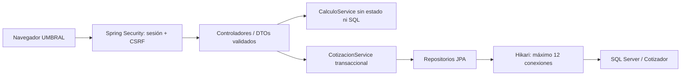

# Arquitectura — @ArchitectAgent

## Componentes y límites

Monolito modular en capas; no se necesitan microservicios para 50–60 usuarios. Los controladores no acceden directamente a SQL. La simulación usa BigDecimal y una raíz duodécima de Newton acotada a 64 iteraciones. No toma conexión ni bloqueo SQL y no almacena estado entre peticiones. El navegador calcula solo formato y representación visual.

## Concurrencia

- Tomcat: hasta 100 hilos y cola de aceptación de 100; máximo 1.000 conexiones TCP. Estos límites acotan recursos, no son garantías de rendimiento.
- Hikari: 12 conexiones, mínimo 2, espera de adquisición 3 segundos. No abrir 60 conexiones por tener 60 usuarios. `DB_POOL_SIZE` permite ajustar tras medir SQL.
- Transacciones de escritura de hasta 10 segundos, consultas de hasta 5 segundos, socket JDBC de 15 segundos. Los límites aplican a distintas etapas; no equivalen a un deadline HTTP global.
- Páginas de 12 filas, máximo 50. Índices compuestos para ejecutivo/fecha y estado/fecha. `EntityGraph` carga asociaciones to-one sin N+1; `open-in-view=false` impide SQL durante el render.
- `@Version` usa un BIGINT. Tanto versión recibida como UPDATE condicionado previenen pérdidas de actualización. Una carrera devuelve un éxito y un 409, sin bloquear toda la cartera.
- Índice único DNI evita duplicación de clientes concurrentes. Si dos altas del mismo DNI colisionan, una recibe 409 y puede repetir; no se reintentan escrituras silenciosamente.
- Se deshabilitan botones durante el envío. No existe garantía exactly-once para repetir un POST de creación después de perder su respuesta: verificar la cartera antes de reenviar.
- Cierre ordenado, sesiones de 30 minutos, health con estado sin detalles SQL.

## Seguridad y operación

BCrypt coste 12 al iniciar sesión; consultas autenticadas reutilizan la sesión y no vuelven a calcular hashes. CSRF activo en formularios y JSON, cookies HttpOnly/SameSite, CSP sin scripts externos y autorización por rol en rutas y métodos. Los ejecutivos consultan únicamente sus propias cotizaciones. Errores normalizados sin SQL ni claves. Cuenta SQL local con SELECT/INSERT/UPDATE, sin DDL ni DELETE; migraciones administrativas separadas.

`/actuator/health` es público sin detalles. Resto de endpoints Actuator bloqueados por seguridad web; para instrumentación de operación configurar un canal privado autenticado, nunca exponer métricas públicamente. Los logs no contienen payloads de clientes. Para producción usar HTTPS, `server.servlet.session.cookie.secure=true`, certificado SQL confiable (`trustServerCertificate=false`), un gestor de secretos y aprovisionamiento de usuarios fuera del perfil `local`.

La versión actual usa sesiones en memoria. Para escalar horizontalmente requiere afinidad de sesión en el balanceador o incorporar Spring Session con Redis; sin eso cambiar de réplica pierde autenticación. Repartir el presupuesto de conexiones entre réplicas. No se ha implementado failover SQL ni se promete disponibilidad ante caída de la base.

## Ensayo de carga reproducible

`scripts/load_test.py` crea 60 clientes HTTP con cookies independientes y sincroniza su comienzo con una barrera. Precarga sesiones para separar el coste de login (reportado aparte). Cada cliente realiza 20 simulaciones. El modo persistente además intercala 4 lecturas paginadas, guarda una cotización, solicita tasa, consulta la bandeja y aprueba con otra sesión. Son 1.680 peticiones medidas para 60 participantes, sin pausa entre solicitudes. Los datos de prueba quedan identificados como `Carga <run>`.

El generador y servidor comparten equipo y usan loopback: no reproduce latencia de red, múltiples equipos, millones de registros ni una jornada completa. Los percentiles y errores reales quedan en `artifacts/load-mixed.json`. Para dimensionar producción, repetir en hardware de destino con datos representativos y carga sostenida; medir CPU, memoria, conexiones pendientes y latencia SQL.

## Alcance funcional

Solo tasas fijas y moneda PEN. Umbrales ilustrativos parametrizados, no score predictivo ni integración real con centrales de riesgo o BCRP. Las snapshots conservan ingreso/deuda/score evaluados. La identidad del cliente no se edita silenciosamente. El historial tiene una solicitud y una decisión por cotización, con actor/comentario/fecha; una bitácora completa de eventos y versionado de políticas son evoluciones posteriores.

Referencias técnicas: [Spring: pool Hikari](https://docs.spring.io/spring-boot/how-to/data-access.html), [Spring Security: CSRF](https://docs.spring.io/spring-security/reference/servlet/exploits/csrf.html).
